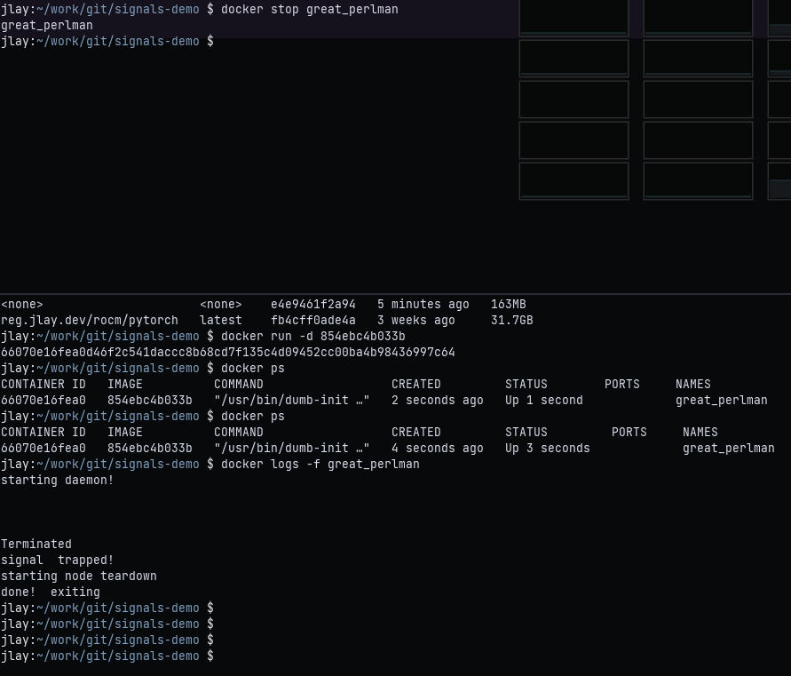

# container-signals
Short and sweet example for using `trap` in BASH with Docker containers to handle signals/container stop requests

**Note**: While this uses *tini* as a very simple `init` process (PID 1) to handle spawning the actual process/pass signals, the image doesn't _need_ to include it.

It's reportedly included with Docker when using the `--init` option with `docker run`, see [upstream](https://github.com/krallin/tini)

## Explanation

This repository provides a script: `runner.sh`

This is used as an `entrypoint` for the container. It spawns a mock daemon (`nc -l`) and will trap these signals:
 - `SIGTERM`
 - `SIGINT`
 - `SIGQUIT`
 - `SIGABRT`

Once the service is running, the script uses `wait` for either the process to terminate, or a signal to be trapped.

`tini` makes this possible -- it forwards the signals it receives from the Docker daemon to the trapping script.

The `_signal_handler` function in the script provides a handle for the shutdown process.

**Note**: `SIGKILL` _cannot_ be trapped. This is generally used in emergency situations (out-of-memory/host machine shutdown timeout) and is unavoidable/expected.

## Example

See below for an example of how the script in the container traps the signal, and runs through some mock cleanup steps

The left pane shows the container logs/messages, including `ps` output with the running process -- _after_ the signal is trapped

While the right pane shows the stop request.

## Dependencies

 - `BASH` (regular `sh` may do, untested)
