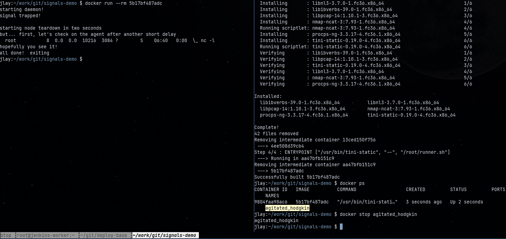

## container-signals
Short and sweet example for using `trap` in BASH with Docker containers to handle signals/container stop requests

## Example

See below for an example of how the script in the container traps the signal, and runs through some mock cleanup steps

The top pane shows the stop request on the container, while the bottom pane shows the logs.

